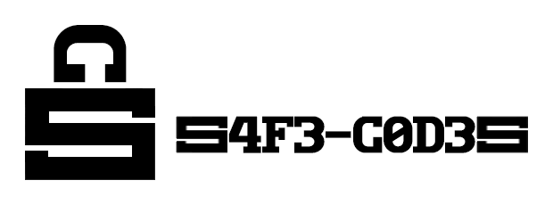
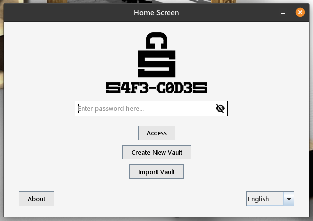
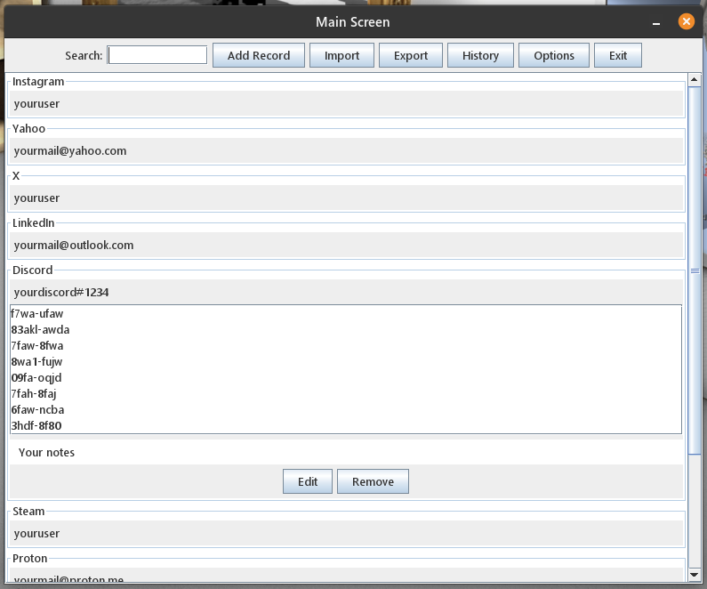

<p align="center">
  
</p>

**S4F3-C0D3S** é um gerenciador de códigos de recuperação (2FA) seguro, criptografado, offline, sem nuvem, gratuito, open-source, sem assinaturas, sem coleta de dados, multiplataforma e portátil.

---

## 💡 A ideia

- O **S4F3-C0D3S** surgiu de uma necessidade real e pessoal de guardar os códigos de recuperação (2FA) com segurança. Muitas vezes, acabamos salvando essas informações sensíveis em **blocos de notas**, **capturas de tela**, **fotos** ou em **arquivos desprotegidos**, o que coloca em risco nossa segurança digital.
- Embora gerenciadores de senhas como o **Bitwarden** ou o **KeePass** sejam muito populares e eficazes para armazenar credenciais, o ditado **"não guarde todos os seus ovos na mesma cesta"** nos lembra que é importante separar diferentes tipos de dados sensíveis, como os códigos de recuperação 2FA. Com o **S4F3-C0D3S**, você pode separar essa informação em um cofre criptografado dedicado, evitando riscos de comprometer múltiplas camadas de segurança de uma única vez.

---

## 🕐 Quando você vai usar o programa?

- Na primeira vez: para reunir e armazenar todos os seus códigos de recuperação 2FA já existentes.
- Sempre que você ativar a 2FA em um novo sistema: assim que ativar, crie um novo registro e salve imediatamente os códigos recebidos.
- Em casos de emergência (tomara que isso não aconteça): se você perder o acesso ao seu autenticador 2FA, basta abrir o programa e utilizar seu código de recuperação salvo para restaurar seu acesso.

---

## 🧩 Funcionalidades

As duas palavras-chave essenciais para se compreender o programa:

**Vault** = registros + histórico + tempo limite de sessão

**Record** = Serviço/Programa/Site/Aplicativo + Usuário/Email/Login + Códigos + Notas (Opcional)

- Criação de cofres protegidos por senha.
- Acesso a cofres existentes mediante a senha correta.
- Adição, edição e remoção de registros.
- Campo de busca para localizar registros por Serviço/Programa/Site/Aplicativo ou por Usuário/Email/Login.
- Histórico de ações realizadas no cofre atual.
- Exportação de cofres e de registros específicos.
- Importação de cofres e de registros específicos.
- Configuração do tempo de expiração da sessão por inatividade.
- Alteração da senha do cofre com recriptografia dos dados.
- Destruição do cofre com sobrescrição dos dados.
- Autodestruição do cofre com sobrescrição dos dados após 10 tentativas incorretas de senha.
- Autodestruição do cofre com sobrescrição dos dados após adulteração nas tentativas.
- Mensagens informativas ao usuário em caso de erro, sucesso, atenção ou ações críticas.
- Proteção visual do campo de senha com ícone para ver/esconder senha.
- Validação de campos obrigatórios.
- Suporte aos idiomas Inglês e Português.
- Alterar o diretório de dados.

---

## 💻 Sistemas Operacionais Testados

O S4F3-C0D3S foi testado e está 100% funcional nos seguintes sistemas operacionais:

- **Windows 11 24H2**
- **Ubuntu 20.04.6 LTS**
- **Pop!\_OS 22.04 LTS**
- **Fedora 34 Workstation**
- **openSUSE Leap 15.3**

ℹ️ A fonte da interface e a aparência da barra de título (superior) das janelas podem variar de acordo com o sistema operacional, mas sem impacto no funcionamento do programa.

🛠️ Testou em outro sistema operacional? Se você utilizar o S4F3-C0D3S em outro sistema operacional, entre em contato com o autor para relatar sua experiência. Isso contribui para expandir a compatibilidade e garantir a melhor experiência para todos os usuários.

---

## ⚙️ Como utilizar o programa?

### Para usuários Windows: 

1. Baixe aqui o .exe: [S4F3-C0D3S.exe](https://github.com/fajremvp/S4F3-C0D3S/releases/download/v2.0.0/S4F3-C0D3S.exe)

2. Verifique se o Java (JRE ou JDK) na versão 17 ou superior está instalado e em uso. Caso não saiba sua versão Java instalada e sendo usada, vá até o terminal e digite o comando:
   ```
   java -version
   ```
3. Execute o programa e comece a usar!

**Recomendações:**

- Utilizar um pendrive como diretório de dados. Na primeira vez que abrir o programa, será solicitado escolher um lugar como diretório. O diretório pode ser alterado a qualquer momento.

### Para usuários Linux: 

1.  Baixe aqui o .AppImage: [S4F3-C0D3S.AppImage](https://github.com/fajremvp/S4F3-C0D3S/releases/download/v2.0.0/S4F3-C0D3S.AppImage)

2.  Verifique se o Java (JRE ou JDK) na versão 17 ou superior está instalado e em uso. Caso não saiba sua versão Java instalada e sendo usada, vá até o terminal e digite o comando:
    ```
    java -version
    ```
3.  Vá até o arquivo baixado (S4F3-C0D3S.AppImage), clique com o botão direito do mouse sobre ele, vá em Propriedades e depois marque a checkbox para ele poder ser executado como programa. **Ou** abra um terminal e navegue até o diretório do .AppImage baixado. Depois certifique-se de que o arquivo baixado (S4F3-C0D3S.AppImage) tenha permissão de execução como programa:
    ```
    chmod +x S4F3-C0D3S.AppImage
    ```
4.  Execute o programa e comece a usar!

**Recomendações:**

- Utilizar um pendrive como diretório de dados. Na primeira vez que abrir o programa, será solicitado escolher um lugar como diretório. O diretório pode ser alterado a qualquer momento.
- Instale o programa [AppImageLauncher](https://github.com/TheAssassin/AppImageLauncher) para ter uma melhor experiência com arquivos .AppImage.

---

## 🖼️ Capturas de Tela

<p align="center">
  
</p>

<i>Tela Inicial - Pop!OS</i>

<p align="center">
  
</p>

<i>Tela Principal - Pop!OS</i>

---

## 🌐 Como o programa funciona: Proteção e Segurança

### 🔐 Derivação de Chave e Criptografia de Dados

- A chave **AES-256** usada na criptografia é derivada diretamente da senha do usuário via **PBKDF2+HMAC-SHA256**. São realizadas **600.000 iterações** e um **salt aleatório de 16 bytes** gerado via _SecureRandom_. Esse número elevado de iterações segue recomendações atuais de segurança (OWASP, 2023), tornando a derivação propositalmente lenta para dificultar ataques por força bruta. O salt de 16 bytes impede o uso de tabelas pré-calculadas (rainbow tables). Como o código não faz hashing prévio da senha antes da derivação, reforça-se que senhas fortes são essenciais para a proteção do cofre.

- Os dados do cofre (registros + histórico + tempo limite de sessão) são criptografados usando **AES-256 em modo GCM com um IV aleatório de 12 bytes** para cada operação. O modo GCM combina cifragem e autenticação: ele fornece confidencialidade e integridade/autenticidade dos dados sem necessidade de um HMAC. Isso significa que qualquer alteração no conteúdo cifrado será detectada na descriptografia, evitando corrupção ou injeção de dados. O texto cifrado (já em Base64) é armazenado junto com o salt de 16 bytes do cofre no arquivo final _.enc_. Em suma, o AES-256-GCM garante que o conteúdo do cofre fique protegido contra leitura ou modificação não autorizada.
- Sempre que o usuário altera a senha de um cofre ou exporta um cofre, o programa automaticamente gera um novo salt aleatório e reexecuta todo o processo de derivação de chave e criptografia. Isso significa que, mesmo que o conteúdo lógico do cofre continue igual, a representação criptografada no disco será completamente diferente. Essa medida impede que atacantes comparem versões antigas e novas do cofre para inferir padrões (ataques de “snapshot” ou “comparação de arquivos”).

### 🛡️ Proteção contra Força Bruta (Delay, arquivo .attempts e autodestruição)

- Cada operação sensível com o arquivo _.enc_ aplica um **atraso mínimo de 3 segundos desde o início da tentativa**, seja para abrir o cofre, importar um cofre ou importar registros. Esse delay sistemático (“sleep”) atrasa automaticamente qualquer tentativa de senha muito rápida, mitigando ataques de força bruta ou medição de tempo. Além disso, há um **limite de 10 tentativas de senha por cofre**. A cada tentativa fracassada, o contador é registrado e o usuário vê apenas uma mensagem genérica de “senha incorreta” e número de tentativas restantes. Se as 10 tentativas se esgotarem, o cofre é considerado comprometido e é autodestruído.
- Para rastrear as tentativas de senha, cada cofre tem um arquivo auxiliar (_.attempts_, que não é exportado junto ao cofre) com três linhas: timestamp da última tentativa, contagem de tentativas usadas e um HMAC dessas duas informações. Isso garante que qualquer modificação no arquivo seja detectada: se o HMAC verificado não bater ou se o timestamp diminuir (roll-back), o cofre é destruído de imediato. Em caso de adulteração do _.attempts_ ou de exceder 10 tentativas, o programa autodestrói o cofre: **o arquivo _.enc_ é sobrescrito e excluído, acompanhado da remoção de seu arquivo _.attempts_**. Esse mecanismo impede contornar o contador de tentativas (por exemplo, zerando, adulterando ou apagando o arquivo) e fornece segurança adicional em caso de invasão.

- Não é possível simplesmente copiar ou mover um cofre para a pasta _dados_ e acessá-lo. A importação deve seguir o fluxo controlado, garantindo a integridade e a segurança dos dados. Se o arquivo _.enc_ (com ou sem arquivo _.attempts_) for colocado manualmente na pasta sem o processo correto, o programa detectará inconsistência com o _.attempts_ ou perceberá ausência de validação interna (HMAC, timestamp, contagem), e também destruirá o arquivo de forma segura. Isso evita tentativas de burlar o limite de 10 tentativas — copiar os arquivos _.enc_ e _.attempts_ para restaurá-los após destruição não funcionará: o sistema compara timestamps e HMACs, e detecta rollback ou adulteração, executando a destruição imediata. Esses controles garantem que backups clandestinos ou restaurações indevidas não possam reviver cofres destruídos, protegendo o usuário até contra ataques locais ou por engenharia social.

- Quando um cofre precisa ser apagado (por atingir o limite de tentativas, por adulteração ou pela própria decisão do usuário), o programa faz uma sobrescrita segura antes de excluir o arquivo. Ele **sobrescreve todo o conteúdo do _.enc_ com bytes aleatórios** (usando _SecureRandom_ num loop) até preencher o tamanho original. Em seguida, fecha-se o arquivo e executa-se _delete()_. Essa rotina de escrita de “lixo” em todo o arquivo assegura que **os dados originais não possam ser recuperados nem por análise forense depois da exclusão**.

### 🧹 Limpeza de Memória

- O programa cuida para limpar informações sensíveis na RAM assim que não são mais necessárias. Sempre que uma senha, salt ou chave temporária deixa de ser usada, o código preenche o array correspondente com zeros (_Arrays.fill_). Essa prática reduz o tempo em que dados críticos ficam expostos na memória, dificultando extração por ferramentas de dump.

### 🫥 Tempo de expiração da sessão

- Cada cofre possui um tempo de sessão configurável (o valor padrão é de 5 minutos). Após esse período de inatividade, a sessão é encerrada automaticamente. O timer reinicia a cada ação do usuário (teclado ou mouse), evitando bloqueios indesejados durante uso ativo. Esse recurso impede que alguém acesse o cofre aberto se o usuário se afastar da máquina.

### 📍 Operação Offline e Recomendações de Uso

- O S4F3-C0D3S foi desenhado para ser totalmente offline: não faz nenhuma conexão de rede, não coleta dados nem sincroniza nada com a nuvem. Todos os dados ficam exclusivamente no dispositivo local. Por segurança operacional, recomenda-se manter o cofre num meio seguro (por exemplo, em um pendrive criptografado ou em outro armazenamento seguro). Como não há dependências online, o risco de ataques remotos é drasticamente reduzido.
- **Sempre tenha um backup!**

---

## 📄 Licença

Este projeto está licenciado sob a [MIT License](https://github.com/fajremvp/S4F3-C0D3S/blob/master/LICENSE) – veja o arquivo LICENSE para mais detalhes.

---

## 🤝 Contribuindo

**Contribuições são muito bem-vindas! Se você quiser ajudar a melhorar o S4F3-C0D3S, siga os passos abaixo:**

- Fork o repositório e crie uma nova branch com a sua feature ou correção de bug.

- Faça suas alterações de forma clara e documentada.

- Envie um pull request descrevendo o que foi alterado e por quê.

- Aguarde a revisão e feedback.

**Sugestões de contribuições:**

- Desenvolver um novo visual (front-end) para o programa. Usar um framework de UI diferente do Java Swing utilizado (que é mais antigo e limitado), como o JavaFX, para criar uma interface mais moderna e amigável.

- Tentar burlar o programa, encontrar falhas de segurança ou vulnerabilidades no código.

- Fazer um instalador mais amigável intuitivo.

- Criar testes automatizados (unitários e integração) para garantir estabilidade do código e facilitar futuras atualizações.

**Você também pode contribuir de outras formas:**

- Reportando bugs

- Sugerindo melhorias

- Testando em outros sistemas operacionais e relatando compatibilidades

- Melhorando a tradução ou documentação

- Divulgando o projeto

---

## 📬 Contato

Estarei sempre aberto a participar de novos projetos, parcerias e colaborações. Se você tem uma ideia ou projeto interessante, chama aí!

Em caso de dúvidas? entre em contato:

Desenvolvedor: Fajre

GitHub: [fajremvp](https://github.com/fajremvp)
