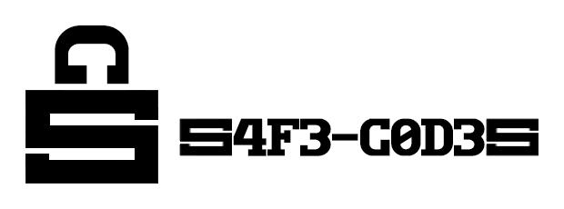
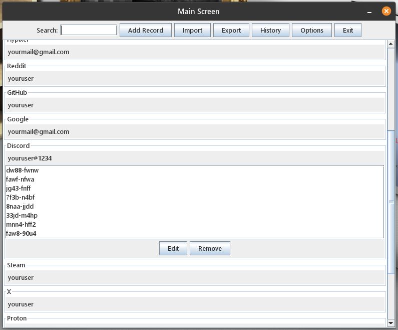

<p align="center">
  
</p>

**S4F3-C0D3S** is a secure, encrypted, offline, cloud-free, free, open-source recovery codes (2FA) manager with no subscriptions, no data collection, cross-platform, and portable.

---

## 💡 The Idea

- **S4F3-C0D3S** was born from a real and personal need to securely store recovery codes (2FA). Many times, we end up saving these sensitive pieces of information in **notepads**, **screenshots**, **photos**, or **unprotected files**, which puts our digital security at risk.
- Although password managers like **Bitwarden** or **KeePass** are very popular and effective for storing credentials, the saying **"don’t put all your eggs in one basket"** reminds us that it’s important to separate different types of sensitive data, such as 2FA recovery codes. With **S4F3-C0D3S**, you can store this information in a dedicated encrypted vault, reducing the risk of compromising multiple security layers at once.

---

## 🕐 When Will You Use the Program?

- The first time: to gather and store all your existing 2FA recovery codes.
- Every time you enable 2FA on a new system: as soon as you activate it, create a new record and immediately save the received codes.
- In emergencies (hopefully this never happens): if you lose access to your 2FA authenticator, just open the program and use your saved recovery code to restore access.

---

## 🧩 Features

The two essential keywords to understand the program:

**Vault** = records + history + session timeout

**Record** = Service/Program/Site/App + User/Email/Login + Codes + Notes (Optional)

- Create password-protected vaults.
- Access existing vaults with the correct password.
- Add, edit, and delete records.
- Search field to locate records by Service/Program/Website/Application or User/Email/Login.
- Action history of the current vault.
- Export vaults and specific records.
- Import vaults and specific records.
- Configure session expiration time due to inactivity.
- Change vault password with data re-encryption.
- Destroy the vault with data overwriting.
- Vault self-destruction with data overwriting after 10 incorrect password attempts.
- Vault self-destruction with data overwriting after tampering with attempts.
- Informational messages to the user in case of error, success, warning, or critical actions.
- Visual protection of the password field with show/hide icon.
- Required field validation.
- Support for English and Portuguese languages.
- Change data directory.

---

## 💻 Tested Operating Systems

S4F3-C0D3S has been tested and is fully functional on the following operating systems:

- **Windows 11 24H2**
- **Ubuntu 20.04.6 LTS**
- **Pop!\_OS 22.04 LTS**
- **Fedora 34 Workstation**
- **openSUSE Leap 15.3**

ℹ️ Interface fonts and window title bar appearance may vary depending on the OS, but this does not affect the program's functionality.

🛠️ Tested on another OS? If you use S4F3-C0D3S on another operating system, contact the author to report your experience. This helps expand compatibility and ensure the best experience for all users.

---

## ⚙️ How to Use the Program?

### For Windows Users: 

1. Download the .exe here: [S4F3-C0D3S.exe](https://github.com/fajremvp/S4F3-C0D3S/releases/download/v2.0.0/S4F3-C0D3S.exe)

2. Ensure Java (JRE or JDK) version 17 or higher is installed and in use. If you’re not sure which version is installed, go to the terminal and type:

   ```
   java -version
   ```

3. Run the program and start using it!

**Recommendations:**

- Use a USB stick as the data directory. The first time you open the program, you will be prompted to choose a location as the directory. The directory can be changed at any time.

### For Linux Users: 

1. Download the .AppImage here: [S4F3-C0D3S.AppImage](https://github.com/fajremvp/S4F3-C0D3S/releases/download/v2.0.0/S4F3-C0D3S.AppImage)

2. Ensure Java (JRE or JDK) version 17 or higher is installed and in use. If you’re not sure which version is installed, go to the terminal and type:

   ```
   java -version
   ```

3. Go to the downloaded file (S4F3-C0D3S.AppImage), right-click on it, go to Properties, and then check the box to allow execution as a program. **Or** open a terminal, navigate to the downloaded .AppImage directory, and ensure the file has execution permission:

   ```
   chmod +x S4F3-C0D3S.AppImage
   ```

4. Run the program and start using it!

**Recommendations:**

- Use a USB stick as the data directory. The first time you open the program, you will be prompted to choose a location as the directory. The directory can be changed at any time.
- Install the program [AppImageLauncher](https://github.com/TheAssassin/AppImageLauncher) for a better experience with .AppImage files.

---

## 🖼️ Screenshots

<p align="center">

</p>

<i>Home Screen - Pop!OS</i>

<p align="center">

</p>

<i>Main Screen - Pop!OS</i>

---

## 🌐 How the Program Works: Protection and Security

### 🔐 Key Derivation and Data Encryption

- The **AES-256** encryption key is derived directly from the user’s password via **PBKDF2+HMAC-SHA256**. It performs **600,000 iterations** and uses a **random 16-byte salt** generated via _SecureRandom_. This high number of iterations follows current security recommendations (OWASP, 2023), making the derivation intentionally slow to hinder brute-force attacks. The 16-byte salt prevents the use of precomputed tables (rainbow tables). Since the code does not pre-hash the password before derivation, it’s crucial to use strong passwords to protect the vault.

- Vault data (records + history + session timeout) is encrypted using **AES-256 in GCM mode with a random 12-byte IV** for each operation. GCM mode combines encryption and authentication: it ensures data confidentiality and integrity/authenticity without requiring a separate HMAC. This means that any change in the encrypted content will be detected during decryption, preventing data corruption or injection. The encrypted text (already Base64-encoded) is stored along with the vault’s 16-byte salt in the final _.enc_ file. In summary, AES-256-GCM ensures that the vault's contents are protected against unauthorized reading or modification.

- Every time the user changes a vault password or exports a vault, the program automatically generates a new random salt and re-runs the entire key derivation and encryption process. This means that even if the vault's logical content remains the same, its encrypted representation on disk will be completely different. This measure prevents attackers from comparing old and new vault versions to infer patterns (snapshot or file comparison attacks).

### 🛡️ Brute-Force Protection (Delay, .attempts file, and Self-Destruction)

- Each sensitive operation with the _.enc_ file applies a **minimum delay of 3 seconds from the attempt's start**, whether opening the vault, importing a vault, or importing records. This systematic delay (“sleep”) automatically slows down fast password attempts, mitigating brute-force or timing attacks. Additionally, there is a **limit of 10 password attempts per vault**. For each failed attempt, the counter is recorded, and the user sees only a generic “wrong password” message and the number of remaining attempts. If all 10 attempts are used, the vault is considered compromised and self-destructs.

- To track password attempts, each vault has an auxiliary file (_.attempts_, which is not exported with the vault) with three lines: timestamp of last attempt, number of attempts used, and an HMAC of both values. This ensures that any modification to the file is detected: if the verified HMAC doesn’t match or the timestamp decreases (rollback), the vault is immediately destroyed. In case of tampering with _.attempts_ or exceeding 10 attempts, the program self-destructs the vault: **the _.enc_ file is overwritten and deleted, along with the _.attempts_ file**. This mechanism prevents attempts to bypass the attempt counter (e.g., resetting, tampering, or deleting the file) and provides extra security in case of intrusion.

- You cannot simply copy or move a vault into the _data_ folder and access it. The import must follow the controlled flow, ensuring data integrity and security. If the _.enc_ file (with or without _.attempts_) is manually placed in the folder without the correct process, the program will detect inconsistencies with _.attempts_ or internal validation absence (HMAC, timestamp, count) and will securely destroy the file. This prevents attempts to bypass the 10-attempt limit—copying the _.enc_ and _.attempts_ files to restore them after destruction won’t work: the system compares timestamps and HMACs, and detects rollback or tampering, executing immediate destruction. These controls ensure that clandestine backups or unauthorized restores cannot revive destroyed vaults, protecting users even from local or social engineering attacks.

- When a vault needs to be deleted (after attempt limit, tampering, or user’s choice), the program performs a secure overwrite before deleting the file. It **overwrites the entire content of the _.enc_ with random bytes** (using _SecureRandom_ in a loop) to fill its original size. Then, it closes the file and runs _delete()_. This “junk write” routine ensures that **original data cannot be recovered even through forensic analysis after deletion**.

### 🧹 Memory Cleanup

- The program takes care to clean sensitive information from RAM once it’s no longer needed. Every time a password, salt, or temporary key is no longer used, the corresponding array is filled with zeros (_Arrays.fill_). This practice reduces the time critical data remains in memory, making it harder to extract using dump tools.

### 🫥 Session Timeout

- Each vault has a configurable session timeout (default is 5 minutes). After this period of inactivity, the session automatically ends. The timer resets with every user action (keyboard or mouse), avoiding unwanted lockouts during active use. This feature prevents someone from accessing an open vault if the user steps away.

### 📍 Offline Operation and Usage Recommendations

- S4F3-C0D3S is designed to be completely offline: it does not make any network connections, collect data, or sync with the cloud. All data remains exclusively on the local device. For operational security, it’s recommended to keep the vault on a secure medium (e.g., an encrypted USB drive or other secure storage). Since there are no online dependencies, the risk of remote attacks is drastically reduced.
- **Always keep a backup!**

---

## 📄 License

This project is licensed under the [MIT License](https://github.com/fajremvp/S4F3-C0D3S/blob/master/LICENSE) – see the LICENSE file for more details.

---

## 🤝 Contributing

**Contributions are very welcome! If you'd like to help improve S4F3-C0D3S, follow the steps below:**

- Fork the repository and create a new branch for your feature or bug fix.

- Make your changes clearly and with documentation.

- Submit a pull request describing what was changed and why.

- Wait for review and feedback.

**Suggestions for contributions:**

- Develop a new (front-end) look for the program. Use a different UI framework than the currently used Java Swing (which is older and limited), such as JavaFX, to create a more modern and user-friendly interface.

- Try to break the program, find security flaws or code vulnerabilities.

- Make a more user-friendly installer.

- Create automated tests (unit and integration) to ensure code stability and ease future updates.

**You can also contribute in other ways:**

- Reporting bugs

- Suggesting improvements

- Testing on other operating systems and reporting compatibility

- Improving translation or documentation

- Promoting the project

---

## 📬 Contact

I'm always open to joining new projects, partnerships, and collaborations. If you have an interesting idea or project, hit me up!

Questions? Get in touch:

Developer: Fajre

GitHub: [fajremvp](https://github.com/fajremvp)
